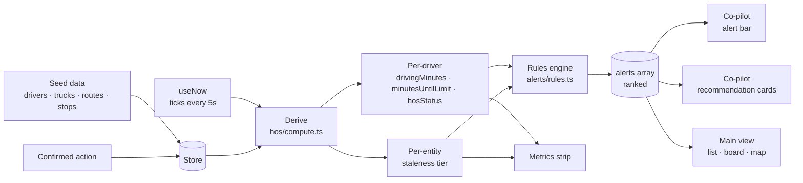
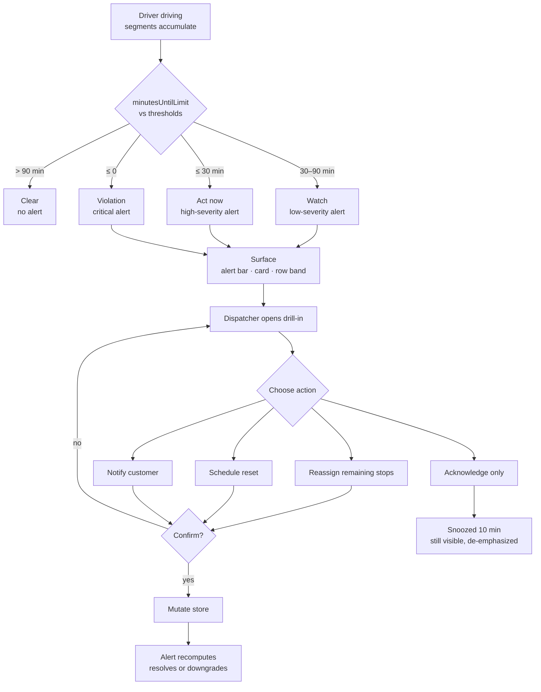
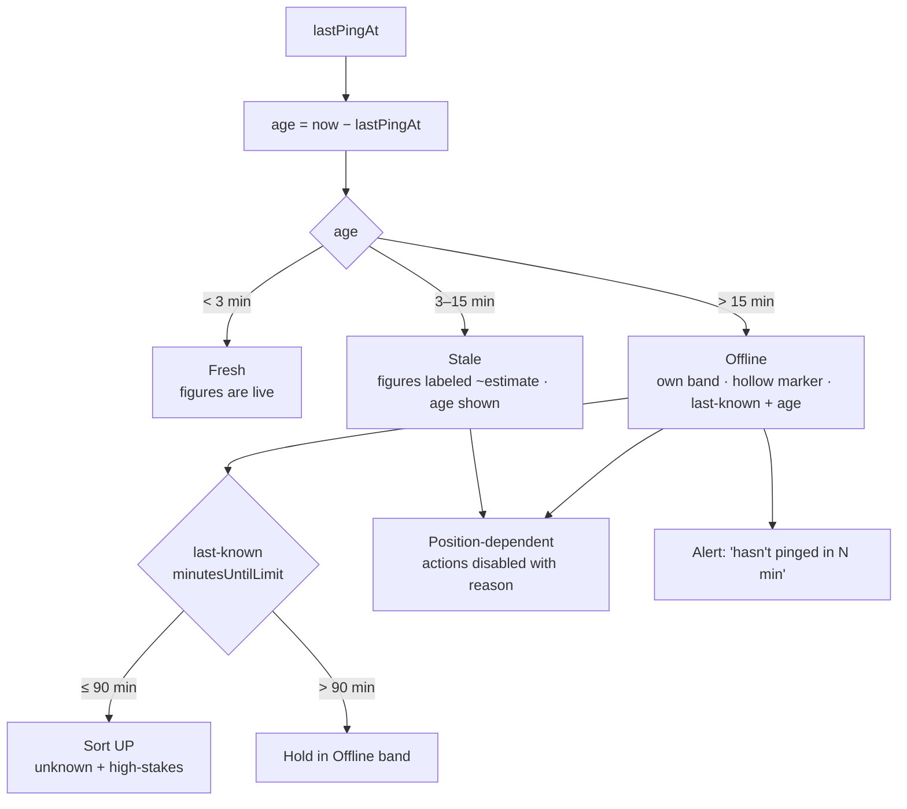
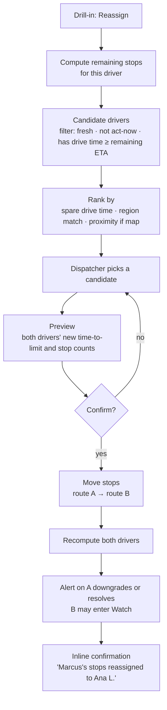
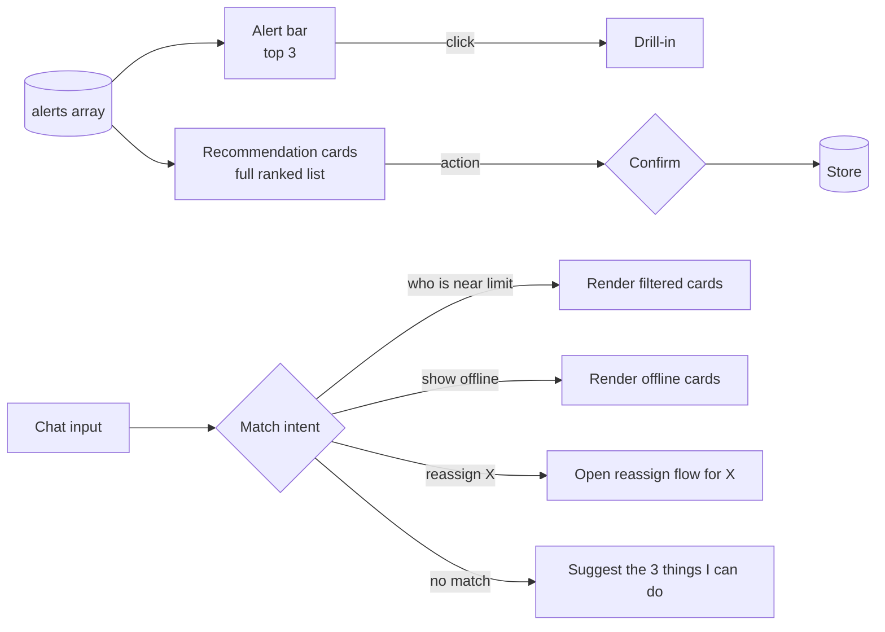
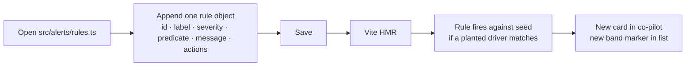

> **2026-09-03 —** `ARCHITECTURE.md` supersedes this file where they differ: the route file is a full page, the main view is a region-column board ranked by urgency (the list view is dropped), the co-pilot is **Lookout**, the clock is simulated at 2:47 PM with simulated pings, and the visual system moved to warm neutrals with Bricolage Grotesque + Inter.

# FLOWS — with the problems each step has to solve

Each flow: a chart, then the issues under it that the build must answer. Charts are Mermaid and render on GitHub.

---

## 1. System flow — from seed to screen

**Issues to solve**

- **Recompute cost.** 50 drivers × rules × every tick is trivial, but the derive step must be memoized on `(store, now)` so React doesn't re-render 50 rows on every tick for no reason. Round `now` to the tick interval before it enters memo keys.
- **Ongoing segments.** A driver mid-drive has a segment with no `endedAt`. Every compute function must close it at `now`. Forgetting this is the classic bug — countdowns freeze.
- **Ranking.** The alerts array needs one stable sort: severity first, then time-to-violation ascending, then staleness (offline before fresh at equal severity). Ties must not reorder on tick or cards will jump.
- **One source of truth.** The co-pilot and the main view both read `alerts`. There must be no second derivation anywhere. If a card and a row ever disagree, that's the bug to find first.
- **Seed determinism.** A seeded PRNG (mulberry32 or similar), not `Math.random()`. Same data on every load, in every browser, on the deployed build.
- **Planted scenarios survive the generator.** Generate the fleet, then overwrite five specific drivers with hand-authored segments so the hero cases are guaranteed.

---

## 2. HOS alert lifecycle — the exception flow

**Issues to solve**

- **Threshold boundaries.** A driver at exactly 30:00 — which band? Decide once, put it in a constant, and test the edge. Bands must be monotonic: a driver can only move act-now → violation over time, never flap.
- **Flapping on the boundary.** With a 5-second tick, a driver crossing 30:00 must not oscillate. Compare against the threshold once per tick using the same `now`. No hysteresis needed if the countdown is monotonic — but confirm it is.
- **What "resolves" means.** After a reassign, the driver still has drive time accumulating. The alert should downgrade (fewer stops → less exposure) or resolve only if the schedule-reset action added an off-duty block. Define the resolution rule per action; don't just delete the alert.
- **Acknowledge ≠ resolve.** A dismissed alert on a driver still 18 minutes from a violation is still a legal problem. Snooze de-emphasizes; it never hides an act-now or violation.
- **Violation is not the end.** A driver over the limit needs a *different* card: not "intervene in time" but "stop now, here's who takes the stops." The copy and actions change.
- **Multiple alerts per driver.** Offline + approaching limit is two rules firing. Show one card with two reasons, not two cards. Group by driver in the ranked array.

---

## 3. Staleness — when the data can't be trusted

**Issues to solve**

- **What keeps counting.** Drive time still accumulates while offline — the truck didn't stop because the radio did. The countdown continues from the last known segment. Label it as an estimate; don't freeze it and don't hide it.
- **Two clocks.** `now − lastPingAt` is data age. `minutesUntilLimit` is legal exposure. They're independent and both shown. Never blend them into one "status."
- **Tier constants.** 3 and 15 minutes are guesses. Put them in one place and say so — real values come from how often the telematics actually pings.
- **Offline is its own band, not a modifier.** In the list, a driver is in the Offline band even if their HOS is clear — because Lena needs to know she's blind on them. But a driver offline *and* near limit needs to sort above a fresh driver at the same HOS. The ranking function handles this; the band is just where the row sits.
- **Recovery.** When a ping comes back, the estimate may jump. Show the correction briefly ("updated — was ~40 min, now 33 min") rather than silently replacing it. Cheap to build, and it's the honest thing.
- **Don't fake precision.** Stale rows show `~0:40` not `0:40:17`. Precision drops with age.

---

## 4. Action — reassign remaining stops

**Issues to solve**

- **Don't create a second problem.** Reassigning 3 stops to a driver 45 minutes from limit just moves the violation. The candidate filter must exclude anyone who'd enter act-now as a result, and the preview must show the receiving driver's *new* countdown.
- **Empty candidate list.** With 50 drivers this is unlikely, but the seed should include a scenario where the best candidate is marginal. The UI needs a graceful "no one has capacity — schedule a reset instead" path.
- **Partial reassign.** Maybe only the last 2 of 3 stops need to move. Support selecting which stops. Default to all remaining.
- **Optimistic vs. confirmed.** Everything is local, so "commit" is instant. Still render the confirm → commit → result sequence deliberately so the interaction reads as consequential.
- **Undo.** A single-level undo on the last action is cheap (store the inverse) and prevents a demo disaster.

---

## 5. Co-pilot — proactive card, then chat

**Issues to solve**

- **The alert bar is not a third list.** It's `alerts.slice(0, 3)`. If it needs its own logic, something's wrong upstream.
- **Card actions must do exactly what drill-in actions do.** Same handlers, same confirm, same result. Duplicated action code is where behavior drifts.
- **Intent matching is a lookup, not a model.** A small array of `{ patterns: RegExp[], handler }`. Phase 2. It exists to show the pattern, not to be clever. Say that plainly in the docs.
- **The no-match path is the most-hit path.** Make it useful: list what the co-pilot can do, with tappable examples.
- **Collapse behavior.** When the pane is collapsed to a rail, the badge shows the act-now count. The bar still exists — it's the rail.
- **Naming.** The co-pilot has its own name and voice. It is a feature of this product, not a reference to anyone else's.

---

## 6. Adding a rule live

**Issues to solve**

- **The rule shape has to be obvious.** Someone reading `rules.ts` for the first time should be able to copy the last object and edit it. Type it tightly so a wrong shape fails at compile, not at demo.
- **A planted driver should match.** The 30-minute break rule (8h cumulative driving, no 30-min break) needs a seed driver who trips it. Plant one now.
- **The filter side.** If the ask is a filter instead of an alert, `src/filters.ts` has the same one-object shape. Plant nothing — filters are declarative.
- **HMR must be fast.** Keep the rules file free of heavy imports. Nothing in there but pure functions and copy.
- **Rehearse it.** Add a rule, delete it, add it again. Under two minutes, narrating.
